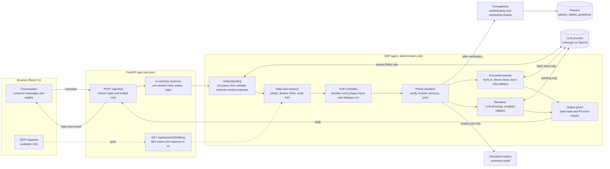
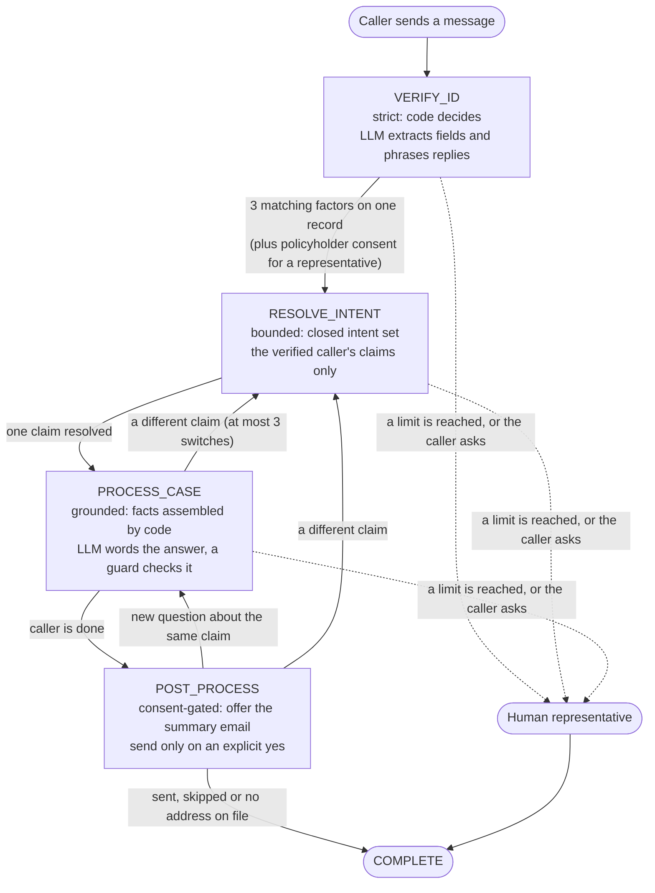

# ClaimDesk

**Guided insurance claims support.** A conversational insurance claims agent that follows a fixed
four-phase SOP while still talking naturally:

```
VERIFY_ID  ->  RESOLVE_INTENT  ->  PROCESS_CASE  ->  POST_PROCESS
```

**The LLM interprets language and phrases replies. Deterministic code controls the workflow,
verification, what data the model can see, and every side effect.** A confused or jailbroken model
has nothing to leak: no claim data is loaded, or placed in any prompt, before identity is verified.

> **All customer, policy, claim and PII data in this repository is synthetic test data.**

Design: [docs/ARCHITECTURE.md](docs/ARCHITECTURE.md) (the frozen design, with an "as built" section
listing where the implementation differs).
Requirements: [docs/requirements-matrix.md](docs/requirements-matrix.md) maps every requirement in
the brief to the mechanism that meets it and the tests that prove it.

## Quick start (Docker)

You need Docker (Docker Desktop on macOS or Windows, or Docker Engine with the Compose plugin on
Linux) and an API key for Anthropic or OpenAI. Nothing else has to be installed.

**1. Create your settings file.** In the repository folder:

```bash
cp .env.example .env          # Windows PowerShell: Copy-Item .env.example .env
```

**2. Add your API key.** Open `.env` in any text editor and paste the key after `LLM_API_KEY=` (no
quotes). With an Anthropic key, that is the only change. With an OpenAI key, also change these three
lines, because the model names must belong to the provider (see [Choosing an LLM](#choosing-an-llm)):

```
LLM_PROVIDER=openai
LLM_MODEL=gpt-5.4-mini
LLM_MODEL_FAST=gpt-5.4-mini
```

**3. Start it.**

```bash
docker compose up --build
```

The first build takes a minute or two (it builds the UI and installs the Python dependencies). Later
starts take seconds. It is ready when the log shows `Application startup complete`.

**4. Check that the key was read.** Open <http://127.0.0.1:8000/api/health>. `"llm_configured": true`
means the key was picked up. If it says `false`, the key is blank or misspelled: fix `.env`, press
Ctrl+C, and run `docker compose up --force-recreate`.

**5. Use it.** Open <http://127.0.0.1:8000>. One container serves the API and the UI on one port.
See [Try it](#try-it) below for a suggested walkthrough. To stop, press Ctrl+C and then run
`docker compose down`.

`.env.example` ships an **evaluator profile**: the workflow inspector and scenario buttons are on,
and "today" is fixed to 2026-03-05 so the sample appeal deadlines are live (CL-2048's deadline,
2026-03-18, is 13 days away). Remove `AS_OF_DATE` to use the real date. The code defaults are the
opposite: inspector off, real date.

### Choosing an LLM

Set these in `.env`. The model names must belong to the provider you choose.

| Provider | `LLM_PROVIDER` | `LLM_MODEL` / `LLM_MODEL_FAST` (examples) |
|---|---|---|
| Anthropic (default) | `anthropic` | `claude-sonnet-5-5` / `claude-haiku-4-5-20251001` |
| OpenAI | `openai` | `gpt-5.4-mini` / `gpt-5.4-mini` |

Put the key in `LLM_API_KEY`. `LLM_REASONING_EFFORT` (OpenAI reasoning models only, for example
`low`) trades some depth for speed. For a deeper live check of your key and models, run
`python scripts/smoke_llm.py` from source: it makes one real call and one real extraction and prints
the results. It is not in the Docker image and needs the Python setup under
[Development](#development).

**Without a key the app still starts.** SOP gates run in plain code, so verification from dates,
phone numbers, emails and ID digits works, and answers come from the claim facts through fixed
templates. Understanding free-form language (names, intent, emotion, scope) needs the model.

### Troubleshooting

- **"Cannot connect to the Docker daemon":** start Docker Desktop and wait until it reports that it
  is running, then repeat step 3.
- **"port is already allocated" or "address already in use" on 8000:** something else is using the
  port. If it is an earlier copy of this app, run `docker compose down`. Otherwise change the
  left-hand number in `docker-compose.yml` (`"127.0.0.1:8000:8000"` becomes `"127.0.0.1:8080:8000"`)
  and open port 8080 instead.
- **Replies feel scripted, or the health page says `llm_configured: false`:** the app is running
  without a model (see above). Re-check step 2, then step 4.
- **Replies feel scripted even though `llm_configured` is `true`:** the key and the model names
  probably belong to different providers, so the model calls fail and the agent falls back to its
  fixed wording. Match them using the table above.
- **Starting over:** `docker compose down`, then `docker compose up --build`. Nothing is stored on
  disk, so there is nothing else to clean up.

### Try it

With the inspector on, the right-hand pane (the "SOP inspector", marked evaluator-only) shows the
agent's workings as structured sections: Workflow, Identity, Current Case, Remembered Context,
Safety and Activity, with the raw internals collapsed under Technical details. The **Demo scenarios**
button in the top bar opens the prepared scenarios: choosing one starts a fresh conversation
and fills the message box; press **Send** to run it. Answers read from the claim record are marked
"Grounded in claim record". On narrow screens the inspector opens from a "Workflow inspector"
button.

| Scenario | What it shows |
|---|---|
| Margaret demo | Verification from a single message, then the denial explained |
| Frustrated caller | Acknowledges the frustration, then verifies; repeated anger offers a human |
| Out-of-scope retries | Polite declines, then a human offer at the limit |
| SSN refusal | Offers phone or email instead; repeated refusals offer a human |
| Representative approved | A son calling for his mother: needs policyholder consent, then verifies |
| Representative timeout | Consent never arrives: no claim details, human offered |

Then try: "how long do I have to appeal?", "what documents do I need?", "I can't get the pathology
report", "what about my dental claim?", and "that's all" (which offers a summary email).

## How it works

### Architecture



*(The diagrams render on GitHub and in any Markdown viewer with Mermaid support. In a plain text editor
they show as readable source, and the text pipeline further down describes the same flow.)*

How to read it:

- **A message flows left to right.** The API finds the session, code understands the message, the
  controller decides what happens, and the reply passes the output guard before it is returned.
- **The model is used in three places only:** extracting fields from the caller's words, wording an
  answer from claim facts that code assembled, and phrasing replies. It has no tools and cannot set
  the phase or who is verified.
- **Claim data has one door.** Only the tool gateway reaches it, only after verification, and only for
  the verified party. Nothing from the claim files is placed in a prompt before that.
- **The inspector is a side channel.** It exists only when `ENABLE_DEBUG_INSPECTOR=true`. The customer's
  API response is always just `{reply, ended}`.

### The workflow, phase by phase



1. **VERIFY_ID (strict).** Callers can give details in any order across several messages. Anything else
   they say (what they are calling about, which claim, a refusal) is remembered but never acted on.
   Three of five factors must match **one** record: full name, date of birth, phone, email, and the last
   four digits of an SSN or national ID. A policy number only finds the record and never counts. Refusing
   one field offers the others at no cost. Refusing verification outright is explained once, then a
   human is offered. Three wrong values stop automated verification and offer a human. A representative
   also needs an authorization record and the policyholder's approval (simulated), which is only
   requested after three factors match.
2. **RESOLVE_INTENT (bounded).** The remembered hints (claim type, status, month, claim number) are
   scored against only the verified caller's claims. One clear match is confirmed in the reply and can
   be corrected. Several candidates get one targeted question. No claims offers a human.
3. **PROCESS_CASE (grounded).** Code assembles the facts (status, denial reason, requested documents,
   the appeal deadline with days remaining computed from the clock) and the matching guidance. The model
   words an answer from those facts alone. A guard checks every claim number, date, amount, day count
   and document name; a failure gets one retry, then the answer is built straight from the facts. A
   request the agent cannot perform (such as filing an appeal) is declined and a human is offered. "I
   can't get that document" gets the guideline's alternatives, then a human.
4. **POST_PROCESS (consent-gated).** When the caller is done, the agent offers a summary email to the
   address on file (shown masked). It sends only on an explicit yes: a bare "okay" or a question never
   counts. A policyholder may name another address, which is read back and needs a second yes. A
   representative can only use the address on file. The summary is built by a template from structured
   notes, with no transcript and no identity values. A new question returns to the claim.

Three things apply in every phase:

- **Scope.** In-scope and general insurance questions are answered. Anything else gets a polite
  decline, repeated attempts lead to a human offer, and attempts to change the agent's instructions
  are declined.
- **Emotion.** A frustrated, anxious, confused or upset caller gets an acknowledgment first, then the
  reason a step exists, then the allowed options, then one next question. Empathy never bypasses a
  gate, and persistent anger or distress leads to a human.
- **Ending.** If the caller finishes before any claim was discussed, the session completes without the
  email offer. A human transfer also ends the automated session.

Margaret's opening message shows the whole path in a single turn: the details and the remembered
"denied healthcare claim from January" are extracted, three factors match, the hints resolve to
CL-2048 without a question, and the denial is explained from the claim's facts.

### The turn pipeline

```
user message
  -> EXTRACT     regex/spoken-form pre-pass + LLM structured extraction (the model only extracts)
  -> VALIDATE    normalize and format-check in code; merge into state (remembering is not acting)
  -> PLAN        the SOP controller picks an ordered list of dialogue acts
  -> PHASE WORK  verify | resolve | process | post   (loops while a phase advances)
  -> RENDER      acts + permitted facts -> reply, with a deterministic template for every act
  -> GUARD       grounding literals, pre-verification leak check, PII-echo check
```

| Phase | Control | What the LLM does |
|---|---|---|
| VERIFY_ID | Strict: pure code decides | Extracts fields, phrases replies |
| RESOLVE_INTENT | Bounded: closed intent set, the verified caller's claims only | Interprets messy language |
| PROCESS_CASE | Grounded: code assembles the facts | Explains and answers from those facts only |
| POST_PROCESS | Consent-gated | Understands yes/no/unclear (code has the final say) |

Margaret's single opening message passes through the first three phases in one turn.

### What is enforced in code, not by prompting

- **Verification needs three matching factors on one record.** Factors are name, date of birth,
  phone, email and the last four digits of an SSN or national ID. A policy number selects a
  candidate but never counts. Matching is exact after normalization (aliases supported). A stated
  ID type must agree with the stored type. Replies never reveal which supplied value failed or the
  stored ID type, so there is no oracle for guessing.
- **Representatives** need three factors of the account holder, an authorization record, and the
  policyholder's consent (simulated from `consent_scenarios.json`) before any access. The consent
  request only happens after the first two checks pass.
- **The tool gateway re-checks `verified` on every call** and takes the party from state, never
  from model output. A claim belonging to someone else is indistinguishable from one that does
  not exist.
- **Answers are grounded.** Every claim number, date, amount, day count and document name in a
  reply must appear in the supplied facts after normalization. A violation is regenerated once
  with specific feedback, then replaced by a reply built straight from the facts. Deadline
  arithmetic is done by code from an injectable clock; the model never computes it.
- **Email is consent-gated.** Nothing is sent without an explicit yes. A bare "okay", "sure" or any
  question never counts, even if the model says it does. A different address (policyholders only)
  is read back masked and needs a second yes; a representative can only use the address on file.
  The summary is built by a template from structured case data, not by the LLM.
- **Escalation is bounded.** Out-of-scope, frustration, refusals, mismatches, consent timeouts and
  document dead-ends all lead to a human offer after a configured limit.
- **Privacy.** Identity values are masked everywhere outside the matcher (an ID's last four digits
  appear only as `****`). Logs contain phases and act names, never message text.

### The inspector (evaluators only)

`ENABLE_DEBUG_INSPECTOR=true` enables `GET /api/session/{id}/debug`, the API docs, the Demo
scenarios menu and the SOP inspector (workflow, identity, current claim, remembered context,
safety, activity, and a collapsed technical-details section). Everything in it is masked. With it off (the code default) the
endpoint returns 404 and no internals appear in any customer-facing response: `/api/chat` returns
only `{reply, ended}`, enforced server-side.

## Configuration

All settings are environment variables (see `.env.example`). Thresholds live in config, never in
prompts; `MIN_FACTORS` below 3 is rejected at startup.

| Variable | Default | Meaning |
|---|---|---|
| `LLM_PROVIDER`, `LLM_API_KEY` | `anthropic`, unset | Provider and key |
| `LLM_MODEL`, `LLM_MODEL_FAST` | Claude models | Replies and answers / per-turn extraction |
| `LLM_REASONING_EFFORT` | unset | OpenAI reasoning models only |
| `FIXTURES_DIR` | `apps/insurance_claims/fixtures` | Where the data comes from |
| `AS_OF_DATE` | real date | Fixed "today" for demos and tests |
| `ENABLE_DEBUG_INSPECTOR` | `false` | Inspector, scenario buttons, API docs |
| `CONSENT_SCENARIO` | `default` | `default` approves, `timeout` never arrives |
| `MIN_FACTORS` | 3 | Matching factors required (minimum 3) |
| `MAX_MISMATCHES` | 3 | Wrong values before verification locks |
| `MAX_VERIFICATION_REFUSALS` | 2 | Refusals before a human is offered |
| `MAX_OOS_STRIKES` | 2 | Out-of-scope requests before a human is offered |
| `MAX_FRUSTRATION_STREAK` | 3 | Frustrated turns before a human is offered |
| `MAX_CONSENT_POLLS` | 5 | Polls of the consent gateway per turn |
| `MAX_CASE_LOOPS` | 3 | Claim switches per conversation |
| `MAX_EMAIL_ADDRESS_ATTEMPTS` | 2 | Rejected alternate addresses |

The data is read from fixtures and never hardcoded, so the fixtures can be swapped
(`FIXTURES_DIR`). Missing optional fields are tolerated.

## HTTP API

| Endpoint | |
|---|---|
| `POST /api/session` | Returns `{session_id, greeting}`. The greeting is fixed text with no customer data. |
| `POST /api/chat` | `{session_id, message}` returns `{reply, ended}`. |
| `GET /api/session/{id}/debug` | Inspector view. 404 unless the inspector is enabled. |
| `GET /api/health` | `{status, llm_configured}`. Never returns the key. |

Sessions are in memory, with unguessable ids, an idle timeout, a cap on live sessions and a cap on
turns per session. One turn runs at a time per session. Request bodies and messages are size
limited. There is no CORS: the API and UI share one origin.

## Testing

```bash
bash scripts/check_all.sh                 # Python tests + lint, UI tests + type-check + build
WITH_DOCKER=1 bash scripts/check_all.sh   # ...plus the Docker smoke test
python scripts/smoke_llm.py               # live check of your LLM key and models
```

- **Python** (`pytest`, 670+ tests): a scripted fake LLM drives every flow deterministically.
  Includes the design's invariants, the fixture-derived scenarios, the grounding guard, the API,
  and tests that real claim details never appear in the extraction prompt or in any reply before
  verification.
- **Requirements matrix** (`scripts/check_matrix.py`): fails if any test or file named in
  `docs/requirements-matrix.md` no longer exists, so the matrix cannot go stale.
- **UI** (Vitest and React Testing Library, about 120 tests): the conversation, error handling, the
  SOP inspector and its view-model adapters, the scenario menu, the drawer and the grounded indicator.
- **Docker smoke test** (`scripts/docker_smoke.sh`): builds the image (running the Python suite on
  the image's Python 3.12), starts the packaged app, and checks the contents (non-root user, no
  `.env`/tests/sources), the served UI, the greeting, that chat exposes only `reply` and `ended`,
  and the inspector gating in both modes.

## Development

```bash
python -m venv .venv && source .venv/bin/activate
pip install -r requirements-dev.txt
python -m pytest -q && ruff check .

# Backend (reads .env)
uvicorn api.main:app --app-dir apps/insurance_claims --reload

# UI with hot reload (proxies /api to port 8000)
cd apps/insurance_claims/ui && npm install && npm run dev      # http://localhost:5173
```

Python 3.12 is what the Docker image runs; development was done on 3.14. The UI needs Node 22.
`npm run build` writes `apps/insurance_claims/ui/dist`, which the API serves automatically.

## Project layout

```
Dockerfile  docker-compose.yml  .env.example  requirements*.txt  pyproject.toml
docs/ARCHITECTURE.md
scripts/   check_all.sh  check_matrix.py  clean_room.sh  docker_smoke.sh  docker_smoke_checks.py
           smoke_llm.py  package.sh
apps/insurance_claims/
  fixtures/        the starter data, unmodified
  agent/           the SOP engine
    controller.py    turn loop, phases, escalation
    state.py         conversation state with guarded transitions
    verify.py        three-factor verification, representative flow
    consent.py       simulated policyholder consent
    tools.py         ownership-checked tool gateway
    understanding.py extraction (pre-pass + LLM) -> TurnUnderstanding
    resolve.py       picks the claim from remembered hints
    context.py       builds the grounded facts for a claim
    guidance.py      document and follow-up guidance
    process.py       grounded answers, one guarded retry, facts-only fallback
    grounding.py     literal-grounding guard
    acts.py templates.py render.py guard.py    dialogue acts, fallbacks, output checks
    summary.py outbox.py                       email summary and simulated outbox
    llm/             provider interface; Anthropic, OpenAI and scripted-test clients; prompts
  api/             FastAPI app: sessions, chat, debug view
  ui/              React + TypeScript + Vite: chat, inspector, scenario buttons
  tests/
```

## Limits and honest notes

- The email "send" writes to a visible in-memory outbox. There is no SMTP.
- Sessions live in memory: a restart clears them. This is a single-instance demo, not a deployment.
- The grounding guard checks literals (numbers, dates, amounts, ids, document names). A sentence
  that states a reason with no literal in it can pass the guard; prompt rules and the bounded
  fact set cover that gap, and the known cases are pinned by tests.
- Consent for representatives is a fixture-driven simulation, not a real notification system.
- **What the LLM provider sees.** The caller's own messages, including any identity details they
  type, are sent to the configured provider so it can extract fields and intent. What is never
  sent: stored identity values (the extraction prompt carries field names only), and any claim
  data before verification. After verification, a claim answer's prompt holds only the verified
  caller's own claim facts, with identity values blanked out.
- **Which provider was exercised live.** The live wording and extraction checks during development
  used OpenAI (`gpt-5.4-mini`). The Anthropic adapter, the default provider, is covered by unit
  tests against a fake client; run `python scripts/smoke_llm.py` with your key to check it live.
- **Dependencies** are bounded to the next major version (`requirements*.txt`) but not locked
  exactly, apart from the UI's `package-lock.json`.
- Where the built system differs from the frozen design (for example, no in-UI key field and no
  send/skip chips), the "as built" section at the end of `docs/ARCHITECTURE.md` says so.
